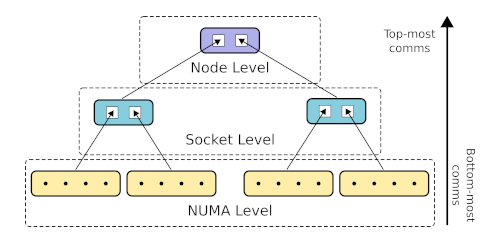

# XHC: XPMEM-based Hierarchical Collectives

XHC, realized as an Open MPI component, implements hierarchical & topology-aware intra-node MPI
collectives, utilizing XPMEM in order to achieve shared address space memory access between
processes/ranks.

## Main features

* Constructs a **n-level hierarchy** (ie. no algorithmic limitation on level count), based on
intra-node topological features. Rank/process locality information is known thanks to hwloc, and is
obtained via Open MPI's integrated mappings.
	
	Topological features that can currently be defined:
	
	- NUMA node
	- CPU Socket
	- L1/L2/L3 cache
	- Hwthread/core
	- Node (all ranks *are* in same node --> flat, no hierarchy at all)
	
	Example of a 3-level XHC hierarchy (numa+socket+node configuration):
	
	

* Support for both **single-copy** and **copy-in-copy-out** data transportation.
	- Switchover at static but configurable message size.
	
	- CICO buffers permanently attached at module initialization
	
	- Application buffers attached on the fly the first time they appear, saved on and recovered
	from registration cache in subsequent appearances. (assuming smsc/xpmem)

* Integration with Open MPI's opal/smsc (shared-memory-single-copy) framework. Selection of
smsc/xpmem is highly recommended.
	
	- Bcast support: XPMEM, CMA, KNEM
	- Allreduce support: XPMEM
	- Barrier support: *(irrelevant)*

* Data-wise **pipelining** across all levels of the hierarchy allows for lowering hierarchy-induced
start-up overheads. Pipelining also allows for interleaving of operations in some collectives
(reduce+bcast in allreduce).

* **Lock-free** single-writer synchronization, with cache-line separation where
necessary/beneficial. Consistency ensured via lightweight *read* or *write* memory barriers.

## Configuration options -- MCA params

XHC can be customized via a number of standard Open MPI MCA parameters, though defaults that should
(?) satisfy a wide number of systems are in place.

The available parameters (also found in `coll_xhc_component.c`):

#### *(prepend with "coll_xhc_")*

* **priority** (default `0`): The priority of the coll/xhc component, used during the component
selection process.

* **print_info** (default `false`): Print information about XHC's generated hierarchy and its
configuration.

* **hpenv** (default `false`): Define some environmental variables, that are interpreted by certain
benchmarks to provide extra output, for testing purposes.

* **shmem_backing** (default `/dev/shm`): Backing directory for shmem files used for XHC's
synchronization fields and CICO buffers.

* **dynamic_leader** (default `false`): Enables the feature that dynamically elects an
XHC-communicator leader at each collective (currently only applicable to bcast).

* **dynamic_reduce** (default `1`=`enabled for non-floats`): Controls the feature that allows for
out-of-order reduction. XHC ranks reduce chunks directly from multiple peers' buffers; dynamic
reduction allows them to temporarily skip a peer when the expected data is not yet prepared,
instead of stalling. Setting to `2`=`enabled for all types`, might/will harm reproducibility of
float-based reductions

* **force_reduce** (default `false`): Force enable the "special" Reduce implementation for all
calls to MPI_Reduce (as long as root == 0). This implementation assumes that the `rbuf` parameter
to MPI_Reduce is valid and appropriately sized for all ranks; not just the root -- you have to make
sure that this is indeed the case with the application at hand.

* **hierarchy** (default `"numa,socket"`): A comma separated list of topological feature to which
XHC's hierarchy-building algorithm should be sensitive. `ompi_info` reports the possible values for
the parameter.
	
	- In some ways, this is "just" a suggestion. The resulting hierarchy may not exactly match the
	requested one. Reasons that this will occur:
		
		- A requested topological feature does not effectively segment the set of ranks. (eg.
		`numa` was specified, but all ranks reside in the same NUMA node)
		
		- No feature that all ranks have in common was provided. This a more intrinsic detail, that
		you probably don't need to be aware of, but you might come across if eg. you investigate
		the output of `print_info`. An additional level will automatically be added in this case,
		no need to worry about it.
			
			For all intents and purposes, a hierarchy of `numa,socket` is interpreted as "segment
			the ranks according to NUMA node locality, and then further segment them according to
			CPU socket locality".
		
		- The provided features will automatically be re-ordered when their order does not match
		their order in the physical system.

* **chunk_size** (default `16K`): The chunk size for the pipelining process. Data is processed
(eg broadcast, reduced) in this-much sized pieces at once.
	
	- It's possible to have a different chunk size for each level of the hierarchy, achieved via
	providing a comma-separated list of sizes (eg. `"16K,16K,128K"`) instead of single one. The
	sizes in this list's *DO NOT* correspond to the items on hierarchy list; the hierarchy keys
	might be re-ordered or reduced to match the system, but the chunk sizes will be consumed in the
	order they are given, left-to-right -> bottom-to-top.

* **uniform_chunks** (default `true`): Automatically optimize the chunk size in reduction
collectives, according to the message size, so that all members will perform equal work.

* **uniform_chunks_min** (default `1K`): The lowest allowed value for the chunk size when uniform
chunks are enabled.

* **cico_max** (default `1K`): Copy-in-copy-out, instead of zero-copy, will be used for messages of
*cico_max* or less bytes.

*(Removed Parameters)*

* **rcache_max**, **rcache_max_global** *(REMOVED with shift to opal/smsc)*: Limit to number of
attachments that the registration cache should hold.

	- A case can be made about their usefulness. If desired, should be re-implemented at smsc-level.

## Limitations

- *Intra-node support only*

- **Heterogeneity**: XHC does not support nodes with non-uniform (rank-wise)
datatype representations. (determined according to Open MPI's `proc_arch`)

- **Non-commutative** operators are not supported by XHC's reduction
collectives. In past versions, they were supported, but only with the flat
hierarchy configuration; this could make a return at some point.

- **Derived datatypes** are not yet considered.

- XHC's Reduce is not yet fully complete. Instead, it is a "special" implementation of MPI_Reduce,
that is realized as a sub-case of XHC's Allreduce.
	
	- If the caller guarantees that the `rbuf` parameter is valid for all ranks (not just for the
	root), like in Allreduce, this special Reduce can be invoked by specifying `root=-1`, which
	will trigger a Reduce to rank `0` (the only one currently supported).
	
		- Current prime use-case: HAN's Allreduce
	
	- Furthermore, if it is guaranteed that all Reduce calls in an application satisfy the above
	criteria, see about the `force_reduce` MCA parameter.

## Building

This section describes how to compile the XHC component.

### Prerequisites

- OpenMPI version 5 (tested on v5.0.0rc6)

- Also suggested:
	- This bug fix: https://github.com/open-mpi/ompi/pull/10127
	- A fix to this bug: https://github.com/open-mpi/ompi/issues/10335
		- See diff for band-aid fix at end of original issue

### Process

XPMEM support in Open MPI is required to reap the full benefits of XHC.
	
- The XHC component will build without XPMEM support, as it goes through the smsc component, but
the Allreduce operation will be disabled at run-time if XPMEM support is not found, and the
Broadcast will fall-back to less efficient mechanisms.

- XPMEM can be obtained from <https://github.com/hpc/xpmem>, and then compiled like a common kernel
module. You might need to manually point Open MPI's configure script to xpmem's installation
location, via the `--with-xpmem=` parameter.

- At run-time, you will need to insert the kernel module and obtain proper rights to `/dev/xpmem`.

Apart from instructing Open MPI to include XPMEM support, the rest of the build process is
standard. General information on building Open MPI can be found in its documentation.

<https://www.open-mpi.org/faq/?category=building>  
<https://github.com/open-mpi/ompi/blob/master/README.md>

## Running

General information on running Open MPI jobs can be found here:  
<https://www.open-mpi.org/faq/?category=running>

`mpirun`'s man page will also be useful:  
https://docs.open-mpi.org/en/v5.0.x/man-openmpi/man1/mpirun.1.html

In order for the XHC component to be chosen, some parameters must be specified.

* The `coll` MCA param, which specifies a list of candidate collective components, needs to include
the `xhc` component. You will also need to list some other fallback components along with xhc, that
implement the functions that xhc doesn't.
	
	- Example: `--mca coll basic,libnbc,xhc`

* XHC's priority must be manually set (unless you modified the default priority in
`coll_xhc_component.c`), with the `coll_xhc_priority` MCA param. The chosen priority can be
anything, but must be higher than any other component that also provides the collective operations
that XHC does, for XHC to be chosen over it.
	
	- Example: `--mca coll_xhc_priority 100`

* Most likely, you will also want the `--bind-to core` param. Otherwise, the reported process
localities might be too general, preventing XHC from correctly segmenting the system.
(`coll_xhc_print_info` will report the generated hierarchy if you wish to experiment)

### Tuning

* Optional: You might wish to manually specify the topological features that XHC's hierarchy should
conform to (default `numa,socket`). See the `coll_xhc_hierarchy` param.
	
	- Example: `--mca coll_xhc_hierarchy numa,socket`
	- Example: `--mca coll_xhc_hierarchy numa`
	- Example: `--mca coll_xhc_hierarchy node`

* Optional: You might wish to tune XHC's chunk size (default `16K`). Use the `coll_xhc_chunk_size`
param, and try values close to the default and see if improvements are observed. You may even try
specifying different chunk sizes for each hierarchy level -- use the same process, starting from
the same chunk size for all levels and decreasing/increasing from there.

	- Example: `--mca coll_xhc_chunk_size 16K`
	- Example: `--mca coll_xhc_chunk_size 16K,32K,128K`

* Optional: If you wish to focus on latencies of small messages, you can try altering the
cico-to-zcopy switchover point (`coll_xhc_cico_max`, default `1K`).
	
	- Example: `--mca coll_xhc_cico_max 1K`

### Example command lines

*Assuming `PATH` and `LD_LIBRARY_PATH` have been set appropriately.*

Default XHC configuration:  
`$ mpirun --mca coll libnbc,basic,xhc --mca coll_xhc_priority 100 --bind-to core <application>`

XHC w/ numa-sensitive hierarchy, chunk size @ 16K:  
`$ mpirun --mca coll libnbc,basic,xhc --mca coll_xhc_priority 100 --mca coll_xhc_hierarchy numa --mca coll_xhc_chunk_size 16K --bind-to core <application>`

XHC with flat hierarchy (ie. none at all):  
`$ mpirun --mca coll libnbc,basic,xhc --mca coll_xhc_priority 100 --mca coll_xhc_hierarchy node [--bind-to core] <application>`

## Benchmarking

This section outlines some tips for benchmarking XHC and intra-node MPI collectives in general.

### Micro-Benchmarks

For our micro-benchmarking purposes, we use a modified version of [OSU's microbenchmark
suite](https://mvapich.cse.ohio-state.edu/benchmarks/) v5.8. Our version of the suite is also
[attached in this repository](../osu-micro-benchmarks).

When micro-benchmarking intra-node collectives, there are some important details that one needs to
look out for.

#### CPU Cache

A problem with the OSU micro-benchmarks is that they use the same buffer for each
iteration without altering it. Since modern processors implicitly cache data, this can lead to
false/unrealistic/unrepresentative results, given that actual real-world applications do not
(usually/optimally!) perform duplicate operations.

Our version of the OSU suite contains "data-varying" benchmarks variants (`_dv` suffix), which will
alter before each iteration the data to be communicated, to counter this problem. We recommend
using them over the default ones across all scenarios.

#### Microbenchmark Barrier

One needs to be aware of how the barrier operation that takes place before each iteration in the
OSU micro-benchmarks affects the performance result, especially so if latencies of small messages
are concerned. The underlying implementation of this barrier and the speed/efficiency of its
"release stage" will affect how fast and how synchronized the ranks will exit the barrier, and
therefore how fast/synchronized they will enter the benchmarked collective operation.

To minimize these effects, use a barrier implementation that has as low a latency as possible. Of
course, it's always a good idea to use the same benchmarking environment for all components. This
can get slightly tricky, especially so when the component providing the best barrier is also one
of the competitors.

In our benchmarks, XHC's barrier was the best one across the board, so this is the one we used.
In some cases, trying out different XHC hierarchies will be able to provide better results.
Alternatively, you might be able to get away with using `coll/sm`'s barrier, depending on the
system -- on ARM N1 it is pretty bad, but on two other x86 systems it did good.

To distinguish between XHC, on of the competitors, and the provider of the pre-op barrier, we
created a new component, XB (=XHC barrier). XB simply creates a new nested (duplicate) communicator
with hints to prefer XHC, and delegates barrier operations to it. We suggest using it for all
benchmarks, for efficient and consistent benchmarking -- it is also [attached in this
repository](../xb).

A slightly inconvenient side-effect of XB's nature is that XHC needs to also be on the coll list
(`--mca coll`) for it to function as expected (XHC doesn't need to have a high priority, but it
can't be less than 0). Functionally, this is not a problem, even when benchmarking XHC itself.

* To benchmark Open MPI's `coll/tuned` with XB: `--mca coll basic,libnbc,tuned,xb,xhc --mca coll_xhc_priority 0 --mca coll_xb_priority 95 --mca coll_tuned_priority 90`

* Or XHC itself, with XB: `--mca coll basic,libnbc,xb,xhc --mca coll_xhc_priority 90 --mca coll_xb_priority 95`

It is also possible to specify the hierarchy to be used for XB's barrier (the
request will be passed in string form to XHC, only for the nested communicator)
via the `coll_xb_hierarchy` MCA parameter.

#### Paper experiments

Below are some/most of the MPI-related settings for the experiments in XHC's paper:

```
OpenMPI v5.0.0rc6, UCX v.12.1, UCC v1.0.0, 
Built with XPMEM support

Map to slot, bind to core, only using 1 hyperthread/core

pml=ob1, or for coll/tuned pml=ucx
btl=sm,self
smsc=xpmem

pml_ucx_tls=any
UCX_TLS=xpmem,self
```

---
Contact: George Katevenis (gkatev@ics.forth.gr), Manolis Ploumidis (ploumid@ics.forth.gr)  
Computer Architecture and VLSI Systems (CARV) Laboratory, ICS Forth
