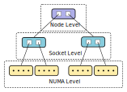

# XHC: XPMEM-based Hierarchical Collectives

XHC, realized as an Open MPI component, implements hierarchical &
topology-aware intra-node MPI collectives, utilizing XPMEM in order to achieve
efficient shared address space memory access between processes.

## Main features

* Constructs an **n-level hierarchy** (ie. no algorithmic limitation on level
count), based on intra-node topological features. Rank/process locality
information is known thanks to hwloc, and is obtained via Open MPI's integrated
book-keeping.
	
	Topological features that can currently be defined:
	
	- NUMA node
	- CPU Socket
	- L1/L2/L3 cache
	- Hwthread/core
	- Node (all ranks *are* in same node --> flat, no hierarchy at all)
	
	Example of a 3-level XHC hierarchy (numa+socket+node configuration):
	
	
	
	Furthermore, support for custom virtual user-defined hierarchies is
	available , to allow fine-grained control over the communication pattern.

* Support for both **zero-copy** and **copy-in-copy-out** data transportation.
	- Switchover at static but configurable message size.
	
	- CICO buffers permanently attached at module initialization
	
	- Application buffers attached on the fly the first time they appear, saved
	on and recovered from registration cache in subsequent appearances.
	(assuming smsc/xpmem)

* Integration with Open MPI's `opal/smsc` (shared-memory-single-copy) framework.
Selection of `smsc/xpmem` is highly recommended.
	
	- Bcast support: XPMEM, CMA, KNEM
	- Allreduce support: XPMEM
	- Reduce (partial) support: XPMEM
	- Barrier support: *(irrelevant)*

* Data-wise **pipelining** across all levels of the hierarchy allows for
lowering hierarchy-induced start-up overheads. Pipelining also allows for
interleaving of operations in some collectives (reduce+bcast in allreduce).

* **Lock-free** single-writer synchronization, with cache-line separation where
necessary/beneficial. Consistency ensured via lightweight *read* or *write*
memory barriers.

## Configuration options -- MCA params

XHC can be customized via a number of standard Open MPI MCA parameters, though
defaults that should satisfy a wide number of systems are in place.

The available parameters (also found in `coll_xhc_component.c`):

#### *(prepend with "coll_xhc_")*

* **priority** (default `0`): The priority of the coll/xhc component, used during
the component selection process.

* **print_info** (default `false`): Print information about XHC's generated
hierarchy and its configuration.

* **shmem_backing** (default `/dev/shm`): Backing directory for shmem files
used for XHC's synchronization fields and CICO buffers.

* **dynamic_leader** (default `false`): Enables the feature that dynamically
elects an XHC-communicator leader at each collective (currently only applicable
to bcast).

* **dynamic_reduce** (default `1`=`non-float`): Controls the
feature that allows for out-of-order reduction. XHC ranks reduce chunks
directly from multiple peers' buffers; dynamic reduction allows them to
temporarily skip a peer when the expected data is not yet prepared, instead of
stalling. Setting to `2`=`enabled for all types`, might/will harm
reproducibility of float-based reductions.

* **lb_reduce** (default `0`=`non-leader`): Controls the leader-to-member load
balancing mode in reductions. Under `non-leader`, the members, and not the
leaders, perform reductions. With `top-level`, all members as well as the
leader of the top-most level perform reductions. With `first-chunk`, leaders
perform a single reduction on each level for a single chunk at the beginning of
the operation. `top+first` combines `top-level` and `first-chunk`. Finally,
with `all`, all ranks perform reductions equally.

* **force_reduce** (default `false`): Force enable the "special" Reduce
implementation for all calls to MPI_Reduce (as long as root == 0). This
implementation assumes that the `rbuf` parameter to MPI_Reduce is valid and
appropriately sized for all ranks; not just the root -- you have to make sure
that this is indeed the case with the application at hand.

* **hierarchy** (default `"numa,socket"`): A comma separated list of
topological feature to which XHC's hierarchy-building algorithm should be
sensitive. `ompi_info` reports the possible values for the parameter.
	
	- In some ways, this is "just" a suggestion. The resulting hierarchy may
	not exactly match the requested one. Reasons that this will occur:
		
		- A requested topological feature does not effectively segment the set
		of ranks. (eg. `numa` was specified, but all ranks reside in the same
		NUMA node)
		
		- No feature that all ranks have in common was provided. This a more
		intrinsic detail, that you probably don't need to be aware of, but you
		might come across if eg. you investigate the output of `print_info`. An
		additional level will automatically be added in this case, no need to
		worry about it.
			
			For all intents and purposes, a hierarchy of `numa,socket` is
			interpreted as "segment the ranks according to NUMA node locality,
			and then further segment them according to CPU socket locality".
		
		- The provided features will automatically be re-ordered when their
		order does not match their order in the physical system. (unless a
		virtual hierarchy is present in the list)
	- *Virtual Hierarchies*: The string may alternatively also contain "rank
	lists" which specify exactly which ranks to group together, as well as some
	other special modifiers. See in
	`coll_xhc_component.c:xhc_component_parse_hierarchy()` for further
	explanation as well as syntax information.

* **chunk_size** (default `16K`): The chunk size for the pipelining process.
Data is processed (eg broadcast, reduced) in this-much sized pieces at once.
	
	- It's possible to have a different chunk size for each level of the
	hierarchy, achieved via providing a comma-separated list of sizes (eg.
	`"16K,16K,128K"`) instead of single one. The sizes in this list's *DO NOT*
	correspond to the items on hierarchy list; the hierarchy keys might be
	re-ordered or reduced to match the system, but the chunk sizes will be
	consumed in the order they are given, left-to-right -> bottom-to-top.

* **uniform_chunks** (default `true`): Automatically optimize the chunk size
in reduction collectives, according to the message size, so that all members
will perform equal work.

* **uniform_chunks_min** (default `1K`): The lowest allowed value for the chunk
size when uniform chunks are enabled.

* **cico_max** (default `1K`): Copy-in-copy-out, instead of zero-copy, will be
used for messages of *cico_max* or less bytes.

*(Removed Parameters)*

* **rcache_max**, **rcache_max_global** *(REMOVED with shift to opal/smsc)*:
Limit to number of attachments that the registration cache should hold.

	- A case can be made about their usefulness. If desired, should be
	re-implemented at smsc-level.

## Limitations

- *Intra-node support only*
	- Usage in multi-node scenarios is possible via OpenMPI's HAN, but
	currently requires locally patching HAN.

- **Heterogeneity**: XHC does not support nodes with non-uniform (rank-wise)
datatype representations. (determined according to Open MPI's `proc_arch`)

- **Non-commutative** operators are not supported by XHC's reduction
collectives. In past versions, they were supported, but only with the flat
hierarchy configuration; this could make a return at some point.

- XHC's Reduce is not fully complete. Instead, it is a "special" implementation
of MPI_Reduce, that is realized as a sub-case of XHC's Allreduce.
	- If the caller guarantees that the `rbuf` parameter is valid for all ranks
	(not just the root), like in Allreduce, this special Reduce can be invoked
	by specifying `root=-1`, which will trigger a Reduce to rank `0` (the only
	one currently supported).
	
		- Current prime use-case: HAN's Allreduce
	
	- Furthermore, if it is guaranteed that all Reduce calls in an application
	satisfy the above criteria, see about the `force_reduce` MCA parameter.
	
	- XHC's Reduce is not yet fully optimized for small messages.

## Building

This section describes how to compile the XHC component.

XPMEM support in Open MPI is required to reap the full benefits of XHC.
	
- The XHC component will build without XPMEM support, but the Allreduce
operation will be disabled at run-time if XPMEM support is not found, and
Broadcast will fall back to less efficient mechanisms.

- XPMEM can be obtained from <https://github.com/hpc/xpmem>, and then
compiled like a common kernel module. You might need to manually point Open
MPI's configure script to XPMEM's installation location, via the
`--with-xpmem=` parameter.

- At run-time, you will need to insert the kernel module and obtain proper
access rights to `/dev/xpmem`.

Apart from instructing Open MPI to include XPMEM support, the rest of the build
process is standard. General information on building Open MPI can be found in
its documentation.

<https://www.open-mpi.org/doc/v5.0>  
<https://www.open-mpi.org/faq/?category=building>  
<https://github.com/open-mpi/ompi/blob/master/README.md>

## Running

General information on running Open MPI jobs can be found here:  
<https://www.open-mpi.org/faq/?category=running>  
<https://docs.open-mpi.org/en/v5.0.x/launching-apps/index.html>

`mpirun`'s man page will also be useful:  
<https://docs.open-mpi.org/en/v5.0.x/man-openmpi/man1/mpirun.1.html>

In order for the XHC component to be chosen, some parameters must be specified.

* The `coll` MCA param, which specifies a list of candidate collective
components, needs to include the `xhc` component. You will also need to list
some other fallback components along with xhc, that implement the functions
that xhc doesn't.
	
	- Example: `--mca coll basic,libnbc,xhc`

* XHC's priority must be manually set (unless you modified the default priority
in `coll_xhc_component.c`), with the `coll_xhc_priority` MCA param. The chosen
priority can be anything, but must be higher than any other components that
also provide the collective operations that XHC does, for XHC to be chosen over
them.
	
	- Example: `--mca coll_xhc_priority 100`

* Most likely, you will also want the `--bind-to core` param. Otherwise, the
reported process localities might be too general, preventing XHC from correctly
segmenting the system. (`coll_xhc_print_info` will report the generated
hierarchy if you wish to experiment)

### Tuning

* Optional: You might wish to manually specify the topological features that
XHC's hierarchy should conform to. The default is `numa,socket`, which will
group the processes according to NUMA locality and then further group them
according to socket locality. See the `coll_xhc_hierarchy` param.
	
	- Example: `--mca coll_xhc_hierarchy numa,socket`
	- Example: `--mca coll_xhc_hierarchy numa`
	- Example: `--mca coll_xhc_hierarchy flat`
	
	In some systems, small-message Broadcast or the Barrier operation might
	perform better with a flat tree instead of a hierarchical one. Currently,
	manual benchmarking is required to accurately determine this.

* Optional: You might wish to tune XHC's chunk size (default `16K`). Use the
`coll_xhc_chunk_size` param, and try values close to the default and see if
improvements are observed. You may even try specifying different chunk sizes
for each hierarchy level -- use the same process, starting from the same chunk
size for all levels and decreasing/increasing from there.

	- Example: `--mca coll_xhc_chunk_size 16K`
	- Example: `--mca coll_xhc_chunk_size 16K,32K,128K`

* Optional: If you wish to focus on latencies of small messages, you can try
altering the cico-to-zcopy switchover point (`coll_xhc_cico_max`, default
`1K`).
	
	- Example: `--mca coll_xhc_cico_max 1K`

* Optional: If your application is heavy in Broadcast calls and you suspect
that specific ranks might be joining the collective with delay and causing
others to stall waiting for them, you could try enabling dynamic leadership
(`coll_xhc_dynamic_leader`), and seeing if it marks an improvement..
	
	- Example: `--mca coll_xhc_dynamic_leader 1`

### Example command lines

*Assuming `PATH` and `LD_LIBRARY_PATH` have been set appropriately.*

Default XHC configuration:  
`$ mpirun --mca coll libnbc,basic,xhc --mca coll_xhc_priority 100 --bind-to core <application>`

XHC w/ numa-sensitive hierarchy, chunk size @ 16K:  
`$ mpirun --mca coll libnbc,basic,xhc --mca coll_xhc_priority 100 --mca coll_xhc_hierarchy numa --mca coll_xhc_chunk_size 16K --bind-to core <application>`

XHC with flat hierarchy (ie. none at all):  
`$ mpirun --mca coll libnbc,basic,xhc --mca coll_xhc_priority 100 --mca coll_xhc_hierarchy node [--bind-to core] <application>`

## Benchmarking

This section outlines some tips for benchmarking XHC and intra-node MPI
collectives in general.

### Micro-Benchmarks

For our micro-benchmarking purposes, we have been using [OSU's microbenchmark
suite](https://mvapich.cse.ohio-state.edu/benchmarks/). However, when
micro-benchmarking intra-node collectives, there are some important details
that one needs to look out for.

**CPU Cache** A problem with the OSU micro-benchmarks is that they use
the same buffer for each iteration without altering it. Since modern processors
implicitly cache data, this can lead to false/unrealistic/unrepresentative
results, given that actual real-world applications do not (usually/optimally!)
perform duplicate operations.

Availability of collective operation source data on a processor's local cache
hierarchy will cause certain phenomenons (eg. slow path memory transactions)
and their effects to remain hidden and undetected in the micro-benchmarking
process. In contrast, with actual applications, they *will* negatively impact
performance.

We have created "data-varying" (`_dv` suffix) benchmarks to counter this
problem, which will alter before each iteration the data to be communicated.

**Microbenchmark's pre-op Barrier** One also needs to be aware how the barrier
that appears before each iteration in the OSU micro-benchmarks affects the
result, especially so if latencies of small messages are concerned. The
underlying implementation of this barrier and the speed/efficiency of its
"release stage" will affect how fast and how synchronized ranks will exit the
barrier, and therefore how fast/synchronized they will enter the benchmarked
collective operation.

For as accurate/clean performance reporting as possible, use a barrier
implementation that has as low a latency as possible. Furthermore, ideally,
all ranks should exit the barrier at the exact same time -- this is more
complex to measure, but can make a difference. In order to have a common
baseline when benchmarking and comparing multiple collectives implementation,
use this same barrier implementation for all benchmark scenarios.

In the environments we tested, the best performing barrier implementation
proved to be XHC's. To allow for easier choice of this specific implementation,
a new collective component `XB` (=xhc barrier) was created.

XB simply creates a new nested (duplicate) communicator with hints to prefer
XHC, and delegates barrier operations to it. A slightly inconvenient
side-effect of this is that XHC needs to also be on the coll list (`--mca
coll`) for XB to function as expected (XHC doesn't need to have a high priority
-- but it can't be less than 0). Functionally, this is not a problem, even when
benchmarking XHC itself.

Alternatively, OpenMPI's `sm` collective component's Barrier implementation is
often good and on-par with XHC, and might be used instead. However, because of
its use of atomic operations it's been observed to perform badly on some
systems, namely ARM-based ones. Experimentally verify its performance to be
certain, for example with the `osu_barrier` benchmark.

* To benchmark Open MPI's `coll/tuned` with XB: `--mca coll basic,libnbc,tuned,xb,xhc --mca coll_xhc_priority 0 --mca coll_xb_priority 95 --mca coll_tuned_priority 90`

* Or XHC itself, with XB: `--mca coll basic,libnbc,xb,xhc --mca coll_xhc_priority 90 --mca coll_xb_priority 95`

It is also possible to specify the hierarchy to be used for XB's barrier (the
request will be passed in string form to XHC, only for the nested communicator)
via the `coll_xb_hierarchy` MCA parameter.

In our fork of the OSU micro-benchmarks, you will also find
"integrity-checking" variants (`_integrity` suffix). These can help verify that
collective operations complete successfully without data corruption.

---

Contact: George Katevenis (gkatev@ics.forth.gr), Manolis Ploumidis (ploumid@ics.forth.gr)  
Computer Architecture and VLSI Systems (CARV) Laboratory, ICS Forth
